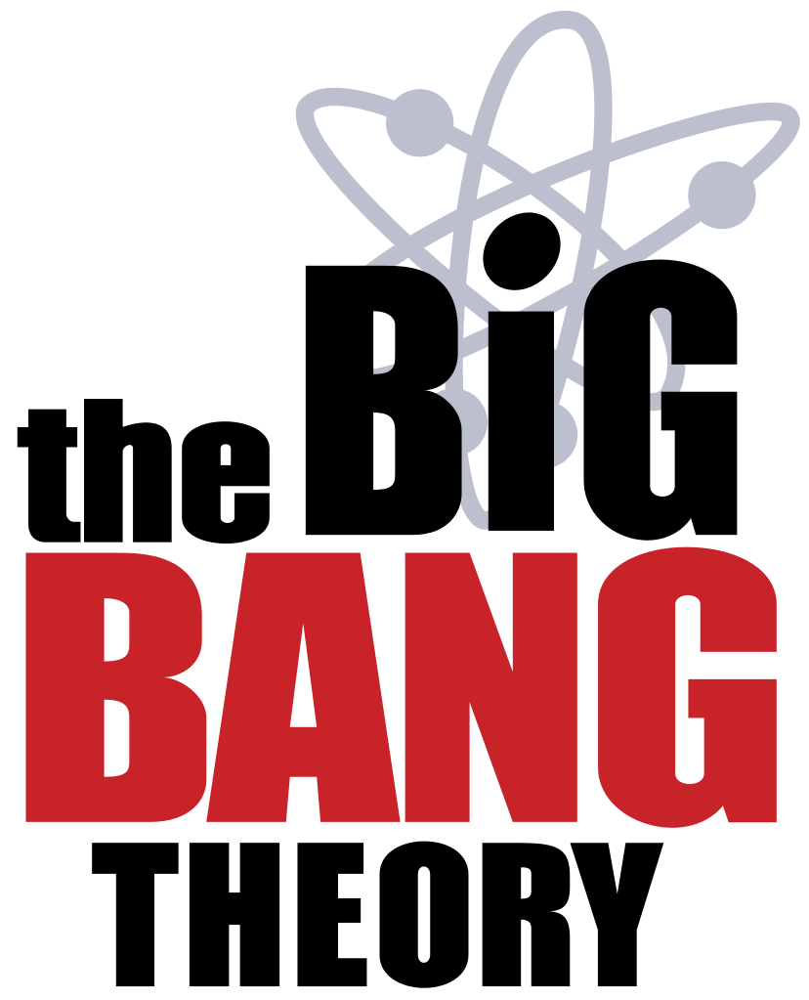
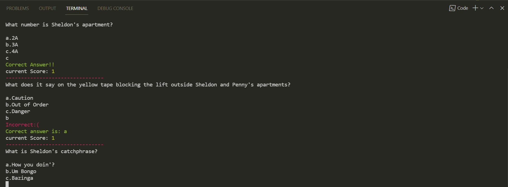

<h1 align="center">The Big Bang Theory CLI quiz⚛</h1>

<p align="center">Are you a Big Bang Theory fan? Play this fun CLI quiz on BBT🤩</p>



<p align="center">A simple Big Bang Theory CLI quiz build using Nodejs</p>

<h1 align="center">Links🌐</h1>

<p align="center">
    <a href="https://replit.com/@DevansuYadav/Level-ZeroBBTCLIquiz#index.js?embed=1&output=1">Live demo on Repl.</a>
    <a href="https://github.com/Devansu-Yadav/BigBangTheory-CLI-quiz">📂Repo</a>
</p>

## Images/Screenshots



## 🚀Features
- Beautiful and Interactive CLI built using [CHALK](https://www.npmjs.com/package/chalk) library.
- You can create your own custom quiz easily!

## 🦋 Prerequisite for running on local
- [Nodejs & Npm](https://nodejs.org/en/) Installed
<br></br>

## 🛠️ Installation Steps

1. Clone the repository

```Bash
git clone https://github.com/Devansu-Yadav/BigBangTheory-CLI-quiz.git
```

2. Change the working directory

```Bash
cd BigBangTheory-CLI-quiz/src
```

3. Run the app using your terminal

```Bash
node bigBangTheory_CLI_game.js
```

## 👷 Built with

- [JavaScript(Nodejs)](https://nodejs.org/en/ "Javascript"): for the CLI quiz.

## How to create your custom quiz?
- Open the `bigBangTheory_CLI_game.js` file in the `src` folder.
- Update the `questionsArray` to add your questions and answers or you can also make your own custom trivia of any Tv series!
- That's it! Now go ahead and play this with your friends:)